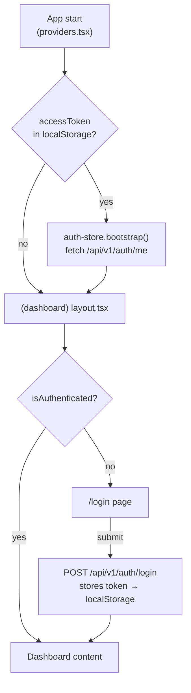

# @repo/admin

The administration dashboard for the SaaS platform. Built with **Next.js 16 App Router**, it allows platform administrators to manage tenants, users, roles, permissions, departments, teams, feature flags, subscriptions, and audit logs.

## Tech Stack

|              |                                    |
| ------------ | ---------------------------------- |
| Framework    | Next.js 16 (App Router, Turbopack) |
| Language     | TypeScript 5.9 (strict)            |
| Styling      | Tailwind CSS v4                    |
| Server state | TanStack Query v5                  |
| Client state | Zustand v5                         |
| HTTP client  | `ApiClient` from `@repo/shared`    |
| Components   | `@repo/ui`                         |

## Pages & Routes

```
/                        → redirects to /dashboard
/login                   → admin login form
/dashboard               → overview stats
/users                   → user management table (CRUD + role assignment)
/roles                   → role management (CRUD + permission assignment)
/tenants                 → tenant management (CRUD)
/departments             → hierarchical department tree (CRUD)
/teams                   → team management + member management
/feature-flags           → feature flag CRUD + toggle
/subscriptions           → subscription management
/audit-logs              → paginated audit log viewer (read-only)
```

All pages under `/(dashboard)/*` are protected by an auth guard in the shared dashboard layout. Unauthenticated users are redirected to `/login`.

## Project Structure

```
src/
  app/
    layout.tsx               # Root layout — wraps with <Providers>
    page.tsx                 # Root redirect (→ /dashboard)
    providers.tsx            # TanStack Query client + auth bootstrap
    login/
      page.tsx               # Login form
    (dashboard)/
      layout.tsx             # Auth guard + sidebar navigation
      dashboard/page.tsx
      users/page.tsx
      roles/page.tsx
      tenants/page.tsx
      departments/page.tsx
      teams/page.tsx
      feature-flags/page.tsx
      subscriptions/page.tsx
      audit-logs/page.tsx
  components/
    sidebar.tsx              # Collapsible navigation sidebar
    help-tooltip.tsx         # Inline help tooltip
  lib/
    api.ts                   # ApiClient instance (reads NEXT_PUBLIC_API_URL)
    auth-store.ts            # Zustand store: login / logout / fetchUser
  config.ts                  # Static app configuration
```

## Auth Flow



1. On app start, `providers.tsx` calls `authStore.bootstrap()` which attempts to fetch the current user from `/api/v1/auth/me` using a stored `accessToken`.
2. The `(dashboard)` layout checks `isAuthenticated`. If false, it redirects to `/login`.
3. On login form submit, credentials are sent to the API, the returned `accessToken` and `refreshToken` are stored in `localStorage`, and the user object is stored in Zustand.
4. On logout, tokens are removed from `localStorage` and the Zustand state is cleared.

## Workspace Dependencies

| Package        | Purpose                                                     |
| -------------- | ----------------------------------------------------------- |
| `@repo/shared` | `ApiClient`, types, constants, DTOs                         |
| `@repo/ui`     | `Button`, `Input`, `DataTable`, `Modal`, `Badge`, `Tooltip` |

## Environment Variables

| Variable              | Default                 | Description                        |
| --------------------- | ----------------------- | ---------------------------------- |
| `NEXT_PUBLIC_API_URL` | `http://localhost:3000` | Base URL of the `@repo/api` server |

Create a `.env.local` file in `apps/admin/`:

```env
NEXT_PUBLIC_API_URL=http://localhost:3000
```

## Scripts

```bash
# Development (Turbopack, port 3001)
pnpm dev

# Production build
pnpm build

# Lint
pnpm lint
```
