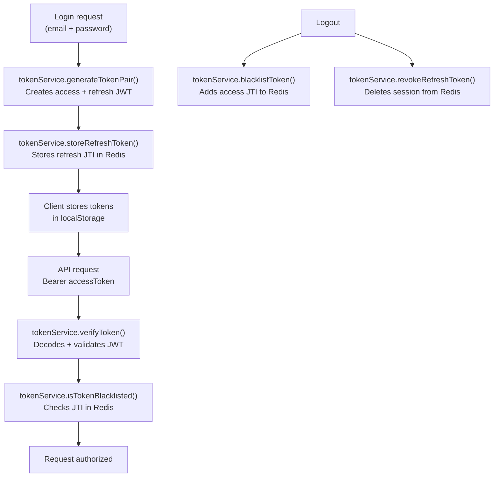

# @repo/auth

Handles JWT token lifecycle management and password hashing for the platform. Uses `jsonwebtoken` for JWT signing/verification and `argon2` for secure password hashing.

## Exports

```typescript
import { TokenService, PasswordService } from '@repo/auth';
import type { JwtPayload, TokenPair } from '@repo/auth';
```

| Export            | Description                                                                      |
| ----------------- | -------------------------------------------------------------------------------- |
| `TokenService`    | JWT access/refresh token generation, verification, and Redis-backed blacklisting |
| `PasswordService` | Argon2 password hashing and verification                                         |
| `JwtPayload`      | TypeScript interface for decoded JWT contents                                    |
| `TokenPair`       | TypeScript interface for the token response object                               |

## `TokenService`

Requires a `CacheService` instance (from `@repo/cache`) for Redis operations.

```typescript
import { TokenService } from '@repo/auth';
import { createCacheService } from '@repo/cache';

const cache = createCacheService();
const tokenService = new TokenService(cache);
```

### Token Flow



### Methods

#### `generateTokenPair(userId, tenantId, email): TokenPair`

Creates a signed access token and refresh token pair. Both tokens contain a unique `jti` (JWT ID). Expiry values are read from `authConfig`.

```typescript
const tokens = tokenService.generateTokenPair('user-123', 'tenant-acme', 'alice@example.com');
// returns: { accessToken, refreshToken, expiresIn }
```

#### `verifyToken(token): JwtPayload`

Verifies the token signature and expiry. Throws a `JsonWebTokenError` if invalid.

```typescript
const payload = tokenService.verifyToken(bearerToken);
// payload: { sub, tenantId, email, jti, type, iat, exp }
```

#### `blacklistToken(jti, expiresInSeconds): Promise<void>`

Adds a JTI to the Redis blacklist with a TTL matching the token's remaining lifetime. Used at logout to invalidate access tokens before they naturally expire.

```typescript
await tokenService.blacklistToken(payload.jti, remainingTtl);
```

#### `isTokenBlacklisted(jti): Promise<boolean>`

Returns `true` if the JTI is in the Redis blacklist.

```typescript
const revoked = await tokenService.isTokenBlacklisted(payload.jti);
if (revoked) throw new Error('Token revoked');
```

#### `storeRefreshToken(jti, userId, tenantId): Promise<void>`

Stores the refresh token's JTI in Redis with the session data. TTL matches `authConfig.jwtRefreshExpiry`.

#### `revokeRefreshToken(jti): Promise<void>`

Deletes the refresh session from Redis.

---

### `JwtPayload` Interface

```typescript
interface JwtPayload {
  sub: string; // userId
  tenantId: string;
  email: string;
  jti: string; // unique token ID (UUID)
  type: 'access' | 'refresh';
  iat?: number;
  exp?: number;
}
```

### `TokenPair` Interface

```typescript
interface TokenPair {
  accessToken: string;
  refreshToken: string;
  expiresIn: number; // access token TTL in seconds
}
```

---

## `PasswordService`

Stateless utility class for hashing and verifying passwords using [argon2id](https://github.com/ranisalt/node-argon2).

```typescript
import { PasswordService } from '@repo/auth';

const passwordService = new PasswordService();
```

### Methods

#### `hash(password): Promise<string>`

Hashes a plaintext password with argon2id. Returns the hash string.

```typescript
const hash = await passwordService.hash('user-password');
// store hash in the database
```

#### `verify(hash, password): Promise<boolean>`

Verifies a plaintext password against a stored hash. Returns `true` if they match.

```typescript
const valid = await passwordService.verify(storedHash, 'user-password');
if (!valid) throw new Error('Invalid credentials');
```

## Workspace Dependencies

| Package        | Purpose                                         |
| -------------- | ----------------------------------------------- |
| `@repo/cache`  | Redis blacklist + refresh token session storage |
| `@repo/config` | `authConfig` (JWT secret, expiry values)        |
| `@repo/shared` | `JwtPayload` type                               |
