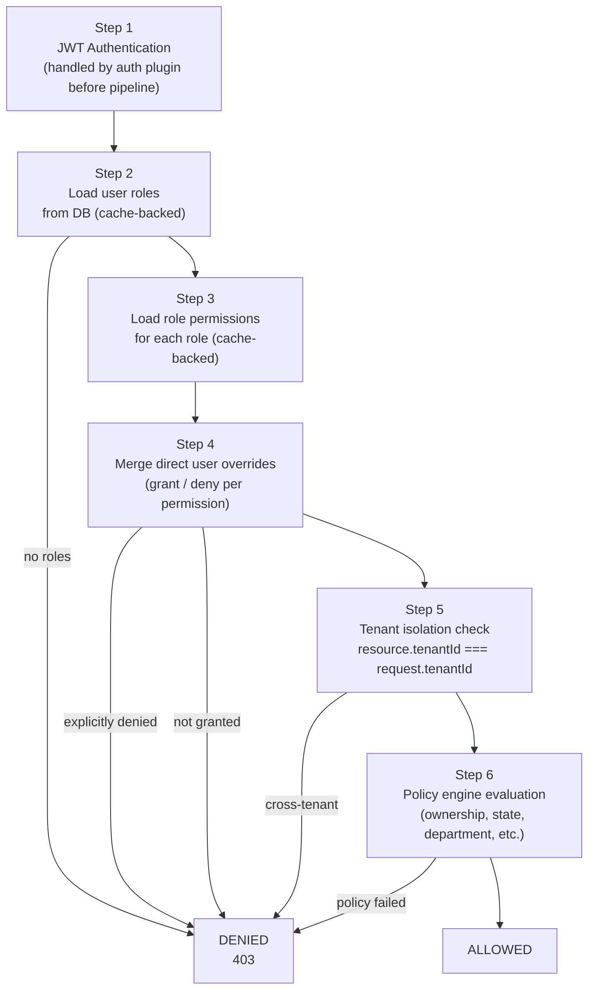

# @repo/rbac

Role-Based Access Control for the SaaS platform. Provides a cache-backed 6-step authorization pipeline and a pluggable policy engine for resource-level rules such as ownership checks, state guards, and department-scoped access.

## Exports

```typescript
import { AuthorizationPipeline, PolicyEngine, BasePolicy } from '@repo/rbac';
import type { PolicyContext, AuthorizationResult } from '@repo/rbac';
```

| Export                  | Description                                                        |
| ----------------------- | ------------------------------------------------------------------ |
| `AuthorizationPipeline` | 6-step authorization orchestrator                                  |
| `PolicyEngine`          | Evaluates registered `BasePolicy` instances by resource and action |
| `BasePolicy`            | Abstract base class for custom resource policies                   |
| `PolicyContext`         | Context object passed to every policy method                       |
| `AuthorizationResult`   | `{ allowed: boolean, reason?: string, step?: string }`             |

## Authorization Pipeline

The pipeline implements a **fail-fast** 6-step check. Any failed step immediately returns a `403` result — no subsequent steps run.



### Permission Merging (Steps 3 + 4)

- **Step 3** aggregates all permissions from all of the user's roles into a `granted` set.
- **Step 4** applies direct `UserPermission` overrides:
  - `type: 'grant'` — adds to the `granted` set
  - `type: 'deny'` — removes from `granted` and adds to a `denied` set; denied permissions cannot be re-granted by a role

A `module.manage` permission automatically satisfies any `module.*` permission check.

### Caching

- User roles: cached under `roles:user:{tenantId}:{userId}` (TTL: 5 min)
- Role permissions: cached under `perm:role:{tenantId}:{roleId}` (TTL: 10 min)
- Merged user permissions: cached under `perm:user:{tenantId}:{userId}` (TTL: 5 min)

## `AuthorizationPipeline` Usage

```typescript
import { AuthorizationPipeline, PolicyEngine } from '@repo/rbac';
import { createCacheService } from '@repo/cache';
import { prisma } from '@repo/db-mysql';

const policyEngine = new PolicyEngine();
const pipeline = new AuthorizationPipeline({
  prisma,
  cache: createCacheService(),
  policyEngine,
});

// Check if userId can perform 'users.read' in tenantId
const result = await pipeline.authorize('user-123', 'tenant-acme', 'users.read');
if (!result.allowed) {
  throw new ForbiddenError(result.reason);
}

// With resource data (enables tenant isolation + policy checks)
const result = await pipeline.authorize('user-123', 'tenant-acme', 'documents.delete', 'document', {
  userId: 'user-456',
  tenantId: 'tenant-acme',
  status: 'draft',
});
```

### Cache Invalidation

Call these whenever roles or permissions are changed to ensure the pipeline doesn't serve stale cached data:

```typescript
// After changing a user's roles or permission overrides
await pipeline.invalidateUserPermissions('user-123', 'tenant-acme');

// After changing permissions assigned to a role
await pipeline.invalidateRolePermissions('role-xyz', 'tenant-acme');
```

---

## `PolicyEngine`

Maintains a registry of `BasePolicy` subclasses keyed by resource type. Evaluates the matching policy when the pipeline reaches Step 6.

```typescript
import { PolicyEngine } from '@repo/rbac';
import { DocumentPolicy } from './policies/document-policy.js';

const policyEngine = new PolicyEngine();
policyEngine.register('document', new DocumentPolicy());

// Evaluation is called internally by the pipeline
const result = await policyEngine.evaluate('document', 'delete', ctx);
```

If no policy is registered for a resource, the engine returns `{ allowed: true }` (the pipeline's permission check already passed).

---

## Writing a Custom Policy

Extend `BasePolicy` and define methods named after the actions you want to guard:

```typescript
import { BasePolicy, PolicyContext, AuthorizationResult } from '@repo/rbac';

export class DocumentPolicy extends BasePolicy {
  // 'delete' action guard
  async delete(ctx: PolicyContext): Promise<AuthorizationResult> {
    // Only the document owner can delete it
    if (!this.isOwner(ctx, 'createdBy')) {
      return {
        allowed: false,
        reason: 'Only the document owner can delete',
        step: 'policy.delete',
      };
    }
    // Document must be in draft status
    if (!this.hasState(ctx, 'status', 'draft')) {
      return {
        allowed: false,
        reason: 'Cannot delete a published document',
        step: 'policy.delete',
      };
    }
    return { allowed: true, step: 'policy.delete' };
  }

  // 'update' action — department-scoped
  async update(ctx: PolicyContext): Promise<AuthorizationResult> {
    if (!this.sameDepartment(ctx)) {
      return {
        allowed: false,
        reason: 'Can only edit documents in your department',
        step: 'policy.update',
      };
    }
    return { allowed: true, step: 'policy.update' };
  }
}
```

Then register it with the engine:

```typescript
policyEngine.register('document', new DocumentPolicy());
```

### `BasePolicy` Helper Methods

| Method                            | Description                                                                                      |
| --------------------------------- | ------------------------------------------------------------------------------------------------ |
| `isOwner(ctx, ownerField?)`       | Returns `true` if `resource[ownerField]` equals the current user's ID. Default field: `"userId"` |
| `hasState(ctx, field, ...states)` | Returns `true` if `resource[field]` is one of the allowed states                                 |
| `sameDepartment(ctx)`             | Returns `true` if `resource.departmentId` matches the user's department                          |
| `isBusinessHours()`               | Returns `true` if current time is Mon–Fri 09:00–18:00                                            |

### Super Admin Bypass

The `before()` hook in `BasePolicy` automatically bypasses all policy checks for users who have the `system.bypass_policies` permission (i.e., super admins). This runs before any action method.

## Workspace Dependencies

| Package          | Purpose                                         |
| ---------------- | ----------------------------------------------- |
| `@repo/cache`    | Caching roles + permissions                     |
| `@repo/db-mysql` | Loading roles and permissions from MySQL        |
| `@repo/shared`   | `CACHE_KEYS`, `CACHE_TTL`, `SYSTEM_PERMISSIONS` |
